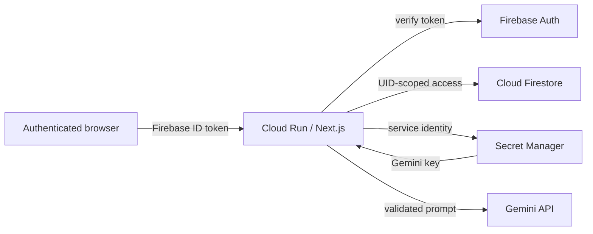

# Architecture



## Authorization invariant

Every protected route verifies a Firebase ID token and derives `uid` from its decoded claims. Document paths are constructed as `/users/{verifiedUid}/...`. There is no API input field that can select another user.

## Data model

```text
/users/{uid}
/users/{uid}/decisions/{decisionId}
/users/{uid}/insights/{insightId}
/users/{uid}/auditEvents/{eventId}
```

Decision documents retain the approved structured snapshot and bounded conversation. Sensitive decisions will be excluded from future cross-entry analysis.

## Model boundary

The backend sends only the conversation required for the current task. Gemini returns structured JSON. The response is schema-validated, displayed as a draft, and only persisted after explicit user confirmation.
